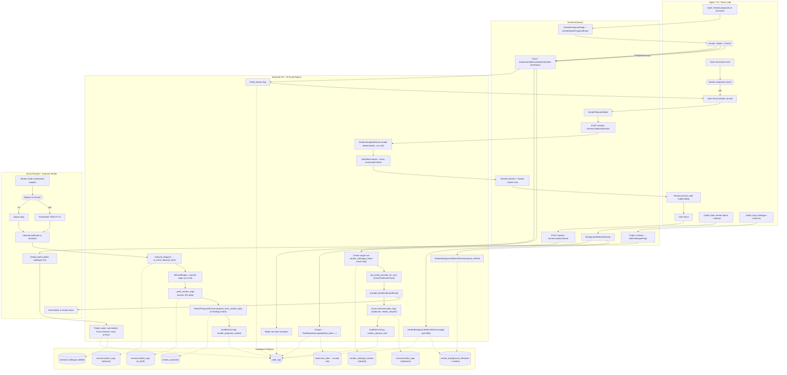

# Vendor Communication System — Diagram Generator Prompt

**Purpose:** Hand the prompt in §3 of this document to an AI diagram generator
(Mermaid Live, Eraser AI, Whimsical, Lucid AI, draw.io AI, ChatGPT + Mermaid,
etc.) to produce a single workflow diagram of the **Vendor Communication
System (Milestone 4.3)** as it actually exists in the codebase today.

**Last verified:** 2026-05-18 against
[velvet-elves-backend/](../velvet-elves-backend/) and
[velvet-elves-frontend/](../velvet-elves-frontend/).

---

## 1. Verification summary — what is actually implemented

The diagram must reflect the *current* shipped behavior. I walked the code
end-to-end before drafting the prompt. The pieces below are wired and used
together; nothing in §3 references a stubbed or planned-only path.

### 1.1 Backend (FastAPI, Supabase Postgres)

| Layer | Files | Status |
|---|---|---|
| Migration | [supabase/migrations/20260622090000_milestone_4_3_vendor_comms.sql](../velvet-elves-backend/supabase/migrations/20260622090000_milestone_4_3_vendor_comms.sql) | Applied |
| Models | [app/models/vendor_email_template.py](../velvet-elves-backend/app/models/vendor_email_template.py), [transaction_vendor_assignment.py](../velvet-elves-backend/app/models/transaction_vendor_assignment.py), [transaction_vendor_assignment_contact.py](../velvet-elves-backend/app/models/transaction_vendor_assignment_contact.py), [vendor_proposal.py](../velvet-elves-backend/app/models/vendor_proposal.py), [vendor_colleague_token.py](../velvet-elves-backend/app/models/vendor_colleague_token.py), [vendor_background_refresh.py](../velvet-elves-backend/app/models/vendor_background_refresh.py) | All present |
| Repositories | `vendor_email_template_repository`, `transaction_vendor_assignment_repository`, `transaction_vendor_assignment_contact_repository`, `vendor_proposal_repository`, `vendor_colleague_token_repository`, `vendor_background_refresh_repository` | All present in [app/repositories/](../velvet-elves-backend/app/repositories/) |
| Services | [vendor_template_service.py](../velvet-elves-backend/app/services/vendor_template_service.py) (deterministic render, no LLM), [vendor_proposal_service.py](../velvet-elves-backend/app/services/vendor_proposal_service.py) (4-strategy task matching, accept/reject/clarify), [vendor_background_search.py](../velvet-elves-backend/app/services/vendor_background_search.py) (tenant-cache suggestions, per-field apply) | All present |
| AI engine hook | [app/services/ai_email_engine.py:259-282](../velvet-elves-backend/app/services/ai_email_engine.py#L259-L282) — after a `vendor_reply` draft is persisted, calls `VendorProposalService.propose_from_vendor_reply(...)` | Wired |
| Routers | [vendor_communications.py](../velvet-elves-backend/app/api/v1/vendor_communications.py), [vendor_public.py](../velvet-elves-backend/app/api/v1/vendor_public.py), [transaction_vendor_assignments.py](../velvet-elves-backend/app/api/v1/transaction_vendor_assignments.py), [vendors.py](../velvet-elves-backend/app/api/v1/vendors.py) — all included by [router.py:48-66](../velvet-elves-backend/app/api/v1/router.py#L48-L66) | Mounted |
| Tests | [app/tests/test_vendor_communications_api.py](../velvet-elves-backend/app/tests/test_vendor_communications_api.py) — 11 tests covering: seed, custom template, preview, engine→proposal happy path, vague reply→needs_clarification, accept updates `tasks.due_date`, reject no-mutation, public colleague roundtrip, background refresh apply, single-primary constraint, communication-log metadata persistence | Passing per testing guide |

### 1.2 Frontend (React + Vite + TanStack Query)

| Layer | Files | Status |
|---|---|---|
| Pages | [src/pages/VendorProposalsPage.tsx](../velvet-elves-frontend/src/pages/VendorProposalsPage.tsx), [vendors/VendorListPage.tsx](../velvet-elves-frontend/src/pages/vendors/VendorListPage.tsx), [vendors/VendorDetailPage.tsx](../velvet-elves-frontend/src/pages/vendors/VendorDetailPage.tsx), [admin/VendorTemplatesPage.tsx](../velvet-elves-frontend/src/pages/admin/VendorTemplatesPage.tsx), [public/AddColleaguePage.tsx](../velvet-elves-frontend/src/pages/public/AddColleaguePage.tsx) | All routed in [App.tsx](../velvet-elves-frontend/src/App.tsx) (lines 140, 193, 197, 198, 282) |
| Components | [components/vendors/VendorRequestModal.tsx](../velvet-elves-frontend/src/components/vendors/VendorRequestModal.tsx), [VendorProposalCard.tsx](../velvet-elves-frontend/src/components/vendors/VendorProposalCard.tsx), [VendorContactCard.tsx](../velvet-elves-frontend/src/components/vendors/VendorContactCard.tsx), [BackgroundRefreshDrawer.tsx](../velvet-elves-frontend/src/components/vendors/BackgroundRefreshDrawer.tsx) | All present |
| Hooks | [useVendorComms.ts](../velvet-elves-frontend/src/hooks/useVendorComms.ts), [useVendorAssignments.ts](../velvet-elves-frontend/src/hooks/useVendorAssignments.ts), [useVendorBackgroundRefresh.ts](../velvet-elves-frontend/src/hooks/useVendorBackgroundRefresh.ts), [useVendorColleagueInvites.ts](../velvet-elves-frontend/src/hooks/useVendorColleagueInvites.ts), [usePublicColleagueInvite.ts](../velvet-elves-frontend/src/hooks/usePublicColleagueInvite.ts) | All present |
| AI Email Review integration | [AiEmailReviewPage.tsx:284-328](../velvet-elves-frontend/src/pages/AiEmailReviewPage.tsx#L284) renders `LinkedVendorProposalPanel` next to vendor-reply drafts | Wired |

### 1.3 Compatibility with the rest of the project

- **Reuses Milestone 4.1's email provider abstraction** — outbound goes
  through `get_email_provider_for_user(...)` so Gmail / Outlook / iCloud
  all work without vendor-comm-specific wiring.
- **Reuses Milestone 4.2's `communication_logs` AI columns** — the proposal
  row links to the existing AI draft via `draft_log_id` and to the vendor's
  inbound via `inbound_log_id`. No parallel logging.
- **Honors PII Fernet-at-rest invariant** — `_safe_decrypt` runs at
  repository edges; `vendor_colleague_tokens.token_hash` stores a SHA-256,
  never the raw bearer.
- **Honors "cost-effective LLM"** — classification is regex; vendor template
  render is deterministic; no LLM call on the happy path. The 4.2 AI
  refinement remains opt-in for the polish pass only.
- **Failure-safe** — the engine wraps the proposal-creation hook in
  try/except, so 4.2 vendor-reply drafting still works even if 4.3
  proposal creation regresses.

**Conclusion:** the system is functioning correctly and is compatible with
existing 4.1 / 4.2 / contacts / vendors / tasks / audit-log infrastructure.
The diagram in §3 can be safely generated from this prompt without
qualifying any node as "planned."

---

## 2. How to use this file

1. Pick a diagram generator that accepts a natural-language workflow brief
   (Mermaid Live + ChatGPT, Eraser AI, Whimsical AI, Lucid AI, draw.io AI).
2. Copy **everything inside the fenced block in §3** as the prompt.
3. If the tool produces Mermaid, paste into `mermaid.live` for a quick PNG.
4. Optional: paste the §4 fallback Mermaid source directly if the
   generator's output drifts from the verified flow.

The §3 prompt is intentionally **role-aware** — it asks for swim lanes
(Agent / AI Engine / Vendor / Public form / Tasks DB) so the role of the
system and how users interact with it is visible at a glance.

---

## 3. Prompt for the AI diagram generator (copy verbatim)

```
Create a single workflow diagram titled "Vendor Communication System (Velvet
Elves — Milestone 4.3)". Use a swim-lane layout (or labeled groups if the
tool does not support lanes). Style: flowchart with clear directional
arrows. Color palette: warm neutrals with one accent color for AI/automated
nodes — do not use red except on the Reject path.

CREATE FIVE SWIM LANES, top to bottom:
  1. "Agent / TC / Team Lead" (internal user, signed in)
  2. "Frontend (React)"
  3. "Backend API (FastAPI) + AI Email Engine"
  4. "Email Provider (Gmail / Outlook / iCloud) + External Vendor"
  5. "Postgres (Supabase): communication_logs, vendor_proposals, tasks,
      vendor_colleague_tokens, vendor_background_refreshes"

ROLE OF THIS SYSTEM IN THE PROJECT (put as a one-line caption above the
diagram):
"Closes the loop between an internal user, their real estate transaction
tasks, and third-party vendors — sending constrained-format requests,
parsing vendor replies deterministically, and gating every task-date
mutation behind a human approval step."

DRAW THE FOLLOWING NODES AND EDGES. Keep node labels short; put the
file/route in a small subtitle when useful.

──────── LANE 1: Agent / TC / Team Lead ────────
  A1  [User opens a transaction task]
  A2  {Decision: vendor assigned to this task?}
  A3  [Click "Email vendor" on task card]
  A4  [Review rendered subject + body in modal; optionally edit]
  A5  [Click Send]
  A6  [Open /vendor-proposals OR /ai-emails to review pending proposals]
  A7  {Decision: Accept / Reject / Ask vendor to clarify}
  A8  [(Side flow) Open vendor detail → Background refresh]
  A9  [(Side flow) Copy colleague-invite link from vendor card]

──────── LANE 2: Frontend (React) ────────
  F1  [VendorRequestModal opens
       src/components/vendors/VendorRequestModal.tsx]
  F2  [POST /api/v1/vendor-communications/preview
       useVendorComms.usePreviewVendorRequest]
  F3  [Render preview pane with subject/body + [VE-TASK-xxxxxxxx]
       thread-marker chip]
  F4  [POST /api/v1/vendor-communications/send
       useVendorComms.useSendVendorRequest]
  F5  [VendorProposalsPage queue + LinkedVendorProposalPanel
       inside AiEmailReviewPage]
  F6  [POST /proposals/{id}/accept | /reject | /needs-clarification]
  F7  [(Public, no auth) /v/:token → AddColleaguePage.tsx → POST
       /api/v1/public/vendor/colleague-invites/{token}/accept]
  F8  [BackgroundRefreshDrawer → POST /vendors/{id}/background-refresh,
       then /background-refresh/apply]

──────── LANE 3: Backend API + AI Email Engine ────────
  B1  [VendorTemplateService.render() — deterministic, NO LLM call
       app/services/vendor_template_service.py]
  B2  [Substitute {{property_address}}, {{task_name}},
       {{task_due_date}}, {{primary_contact_name}}, {{response_footer}},
       {{colleague_invite_url}}; force "Reply with: Scheduled:
       YYYY-MM-DD" footer if absent]
  B3  [Create single-use vendor_colleague_token (SHA-256 hash stored,
       raw token in URL only)]
  B4  [get_email_provider_for_user() — reuse Milestone 4.1 provider
       abstraction (Gmail / Outlook / iCloud)]
  B5  [Provider.send(OutboundEmail)]
  B6  [Insert communication_logs row:
         ai_kind='vendor_request', direction='outbound',
         metadata_json.task_id, metadata_json.template_id,
         metadata_json.vendor_id, thread_key='VE-TASK-xxxxxxxx',
         message_id_header]
  B7  [AuditService.log(action='vendor_request_sent')]
  B8  [Inbound webhook hits inbound_dispatch.py (Milestone 4.1)
       → persists inbound communication_logs row, calls
       ai_email_inbound_hook]
  B9  [AIEmailEngine._classify() — regex match on
       'Scheduled: YYYY-MM-DD' / "we can come" → kind=vendor_reply
       (no LLM call)]
  B10 [_draft_vendor_reply() — extract ISO date,
       confidence 0.9 if found, 0.6 otherwise; persist AI draft
       row (parent_log_id = inbound row)]
  B11 [VendorProposalService.propose_from_vendor_reply():
       4-strategy task match
         1. In-Reply-To header → metadata_json.task_id
         2. thread_key → metadata_json.task_id
         3. Subject marker [VE-TASK-xxxxxxxx] → metadata_json.task_id
         4. Most recent outbound to vendor within 14 days
       Status = pending if date parsed, else needs_clarification.
       Idempotent on draft_log_id.]
  B12 [AuditService.log(action='vendor_proposal_created')]
  B13 [Accept: VendorProposalService.accept() →
       TaskRepository.update(task, due_date=proposed_due_date) →
       AuditService.log('vendor_proposal_accepted', before/after)]
  B14 [Reject: VendorProposalService.reject() → no task mutation,
       audit 'vendor_proposal_rejected']
  B15 [Clarify: VendorProposalService.mark_needs_clarification()
       → status flips, audit 'vendor_proposal_needs_clarification']
  B16 [VendorBackgroundSearchService.queue_refresh() →
       suggestions_json (tenant-cache contacts + same-name vendors)]
  B17 [VendorBackgroundSearchService.apply() — only fields the user
       ticked; per-field audit log
       'vendor_background_refresh_applied']
  B18 [Public router: GET/POST /api/v1/public/vendor/colleague-invites/
       — rate-limited (20 GETs/min, 10 POSTs/min); reveals only vendor
       company name + tenant branding; never marks primary; consumes
       token by hash; writes contact + audit
       'vendor_colleague_added']

──────── LANE 4: Email Provider / External Vendor ────────
  E1  [Outbound email lands in vendor's inbox]
  E2  [Vendor reads constrained-format request]
  E3  {Decision: vendor replies with the constrained format?}
  E4  [Vendor sends "Scheduled: 2026-07-12" (happy path)]
  E5  [Vendor sends a vague reply ("we can come next week")]
  E6  [(Side flow) Vendor opens colleague link, fills public form]
  E7  [Provider webhook delivers inbound to backend]

──────── LANE 5: Postgres ────────
  D1  [(Insert) communication_logs (outbound, vendor_request)]
  D2  [(Insert) vendor_colleague_tokens (hashed)]
  D3  [(Insert) communication_logs (inbound, vendor)]
  D4  [(Insert) communication_logs (ai_draft, vendor_reply,
       parent_log_id → D3)]
  D5  [(Insert) vendor_proposals (status=pending or
       needs_clarification, links D3 + D4 + task_id)]
  D6  [(Update) tasks.due_date — ONLY on accept]
  D7  [(Insert) contacts (vendor colleague) — public flow]
  D8  [(Insert) vendor_background_refreshes; (Update) vendors row on
       per-field apply]
  D9  [(Insert) audit_logs rows for every state transition]

DRAW THESE EDGES (group by phase, label each with the trigger or
return shape).

PHASE 1 — OUTBOUND REQUEST (happy path):
  A1 → A2
  A2 (yes) → A3
  A2 (no) → [Note: agent must assign a vendor via
             /transactions/{id}/vendor-assignments first]
  A3 → F1 → F2 → B1 → B2 → F3 → A4 → A5 → F4 → B3 → B4 → B5 → E1
  B5 → B6 (insert D1)
  B3 → D2
  B6 → B7 (insert audit D9)

PHASE 2 — VENDOR REPLY (constrained):
  E2 → E3
  E3 (yes) → E4 → E7 → B8 (insert D3) → B9 → B10 (insert D4)
       → B11 (insert D5) → B12 (audit D9)
  E3 (no)  → E5 → E7 → B8 → B9 → B10 (confidence ~0.6) → B11
       (status=needs_clarification, proposed_due_date=NULL) → B12

PHASE 3 — HUMAN APPROVAL:
  A6 → F5 → A7
  A7 (Accept)  → F6 (/accept) → B13 → D6 (tasks.due_date updated)
       + audit D9
  A7 (Reject)  → F6 (/reject) → B14 → audit D9 only
  A7 (Clarify) → F6 (/needs-clarification) → B15 → audit D9
       (then agent re-opens VendorRequestModal to send the
        clarification — loop back to A3)

PHASE 4 — SIDE FLOW: COLLEAGUE INVITE (public, no auth):
  A9 → F7 (link copied → emailed externally) → E6 → B18 →
       D7 (contact created) + audit D9
  Note: tokens are single-use, TTL = 168h default, never mark primary.

PHASE 5 — SIDE FLOW: VENDOR BACKGROUND REFRESH:
  A8 → F8 → B16 (insert D8 pending) → suggestions returned →
       user ticks fields → F8 (/apply) → B17 → D8 update +
       vendors row update + per-field audit D9

ANNOTATIONS / CALLOUTS TO ADD ON THE DIAGRAM:
  * On B1 / B2 add a small badge: "Deterministic — no LLM call"
  * On B9 / B10 add a badge: "Regex classify — no LLM on happy path"
  * On D6 add a callout: "tasks.due_date NEVER mutates without
    explicit user accept"
  * On B3 / D2 add a callout: "Raw token in URL only; DB stores
    SHA-256 hash"
  * On B18 add a callout: "Rate-limited; reveals only company name +
    tenant branding; never sets primary contact"
  * On D5 add a callout: "Idempotent on draft_log_id — re-running the
    engine does not duplicate proposals"

LEGEND TO INCLUDE:
  * Solid arrow  = synchronous call
  * Dashed arrow = side effect (DB insert / audit)
  * Diamond     = user or system decision
  * Rounded box = UI screen / user action
  * Rectangle   = backend service or API endpoint
  * Cylinder    = database table

DO NOT include nodes for SMS, voice calls, MLS integration, or
predictive timeline alerts — those are explicitly out of scope for
Milestone 4.3 (hooks exist but the UI shows a "coming soon" tooltip,
and we don't want them on the canonical workflow diagram).

OUTPUT:
  1. The diagram itself.
  2. Below the diagram, a 5–8-line plain-English caption that names
     the role of the system ("AI-assisted, human-gated vendor request
     and scheduling loop") and the two invariants:
        (a) no task date moves without human approval, and
        (b) no LLM call on the happy classification path.
```

---

## 4. Fallback Mermaid source (paste into mermaid.live if the generator drifts)

If the AI diagram generator returns something that disagrees with §1, paste
the source below into [mermaid.live](https://mermaid.live) instead. It is
hand-built to match the verified code paths and uses Mermaid's `flowchart`
with subgraph swim lanes.



---

## 5. Notes for the diagrammer

- The diagram answers three questions, in this order: **what role does the
  system play, what is its workflow, how do users touch it.** The §3 prompt
  enforces all three by way of the swim lanes, phase grouping, and
  user-action nodes in lane 1.
- The "Frontend" lane is intentionally a thin translation layer; the
  *business rules* (deterministic render, regex classify, 4-strategy task
  match, accept-only task mutation) all live in the Backend lane. That is
  exactly how the code is structured.
- If the generator can color nodes, mark every node in the Backend lane
  that performs a `communication_logs` insert/update with the same hue so
  the "unified log" deliverable is visible without text.
- Keep the diagram to one page. If the generator splits into multiple
  pages, drop the side flows (A8/A9 + their lanes) onto a secondary
  diagram and keep phases 1-3 on the primary.

**End of prompt document.**
