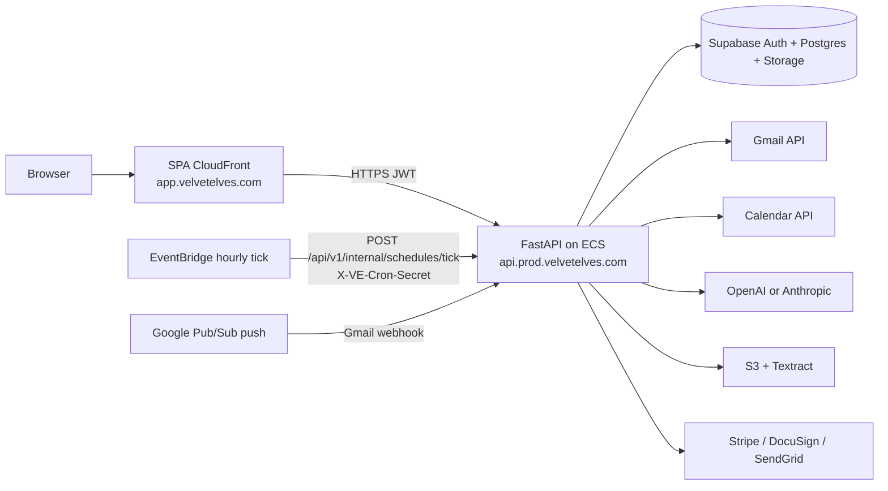

# M9a — Architecture (as deployed, 21 Aug 2026)

`SYSTEM_DESIGN.md` (March 2026) still draws the API as “AWS EC2 / Docker.” Live production is **CloudFront SPA + ECS/Fargate API**. Use this page for the lab, not that diagram.

## Trust boundaries

| Piece | Role |
| --- | --- |
| SPA | React/Vite on CloudFront. Session JWT in `localStorage`. No Google tokens in the browser. |
| API | FastAPI. Verifies Supabase JWT, encrypts Google tokens with Fernet, calls Google/AI. Production `APP_ENV=production` hides Swagger (`/api/docs` `/api/redoc` `/api/openapi.json` **404** as of 22 Aug 2026). Staging still serves docs. |
| Supabase | Auth (GoTrue) + Postgres. App-layer `tenant_id` is the isolation claim; RLS is defense in depth. |
| EventBridge | Hourly tick. Renews Gmail `users.watch` for **idle** mailboxes, plus digests/auto-drafts. Do not write “renews daily” as a separate job. |
| Google | OAuth (PKCE) + Gmail + Calendar + Pub/Sub. Project `velvet-vles` / `538509143953`. Do not change Console scopes. |
| AI | Inbound triage and drafts. Human Approve & send before `gmail.send`. |
| Textract | Document OCR. AWS org AI opt-out is live (M9j). |

Staging mirrors this at `app.stage.velvetelves.com` / `api.stage.velvetelves.com`.
