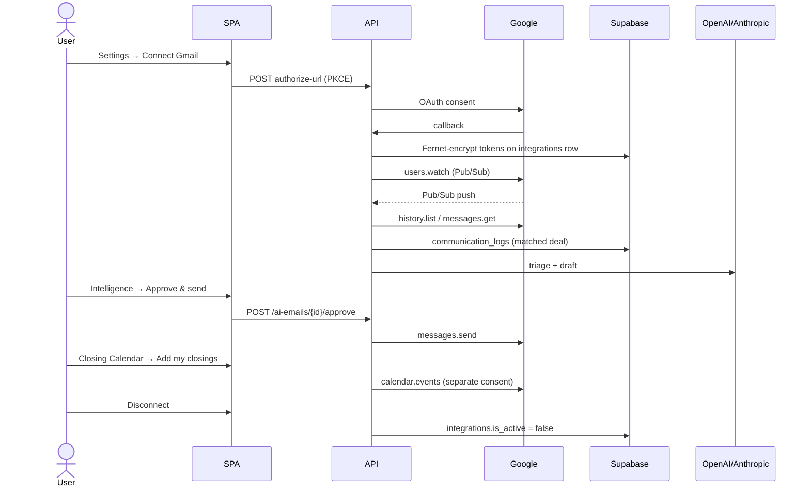

# M9b — Google-user-data flow

Matches code on 21 Aug 2026. Watch renewal is the **hourly EventBridge tick** plus opportunistic renewal after a successful webhook sync. It is **not** a dedicated daily “renew watch” job.

## Steps

1. **Connect.** SPA popup → `POST /api/v1/integrations/gmail/authorize-url` → Google consent → `GET .../gmail/callback`. PKCE. Tokens stored encrypted (`M9d`). Popup `postMessage` only to `FRONTEND_URL`. Calendar is a **separate** consent (`provider=google_calendar`).
2. **Inbound.** Gmail `users.watch` → Pub/Sub HTTPS push → JWT-checked webhook → `history.list` / `messages.get` → `dispatch_inbound_email` matches an open transaction → `communication_logs`. Idle watches are renewed on `POST /api/v1/internal/schedules/tick` (`renew_due_gmail_watches`). Busy mailboxes also renew after sync.
3. **Draft.** AI engine writes a draft on the transaction. No send yet.
4. **Send.** Human Approve & send or Edit & send (`POST /api/v1/ai-emails/{id}/approve`). Then `users.messages.send` only. App does not request `gmail.modify`.
5. **Calendar.** Optional second connect. `calendars/primary/events` create/update for closings the user chooses to push.
6. **Disconnect.** `DELETE /api/v1/integrations/{provider}` sets `is_active=false`. Product stops calling Google. **Encrypted tokens remain on the row** (soft deactivate, not a token wipe). User can also revoke at [Google Account connections](https://myaccount.google.com/connections).
7. **Deletion.** Public SLA: [velvetelves.com/data-deletion](https://velvetelves.com/data-deletion) — stored Google-derived data deleted or anonymized **within 30 days** after a request to `support@velvetelves.com`, except legal/audit/transaction-record holds. Tenant-level purge is `TenantDeletionService` after a scheduled grace; `integrations` is **not** in `DELETION_ORDER` today (follow-up: include it or null tokens on disconnect).
